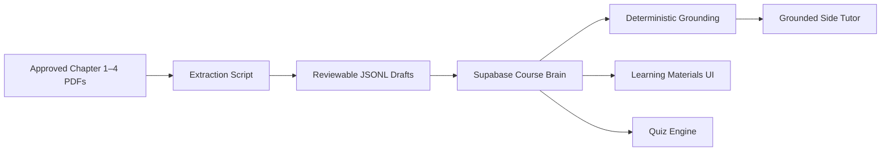

# Course Brain v1 Architecture

## System of record

Supabase/Postgres stores approved chapters, topics, content units, source references, quiz questions, and anonymous feedback. The original PDFs stay in controlled local or cloud storage and are not committed to Git by default.

## Trust boundary

The Course Brain is authoritative. A future language model is an explanation layer: it receives retrieved approved source excerpts, not permission to assert uncited course facts. Published content is blocked by a database constraint trigger if no source reference exists.

## Learner accounts and roles (added 2026-08-17)

Authentication, learner records, and a lecturer dashboard are no longer excluded. Supabase Auth
holds two seeded accounts; `public.profiles` gives each one a role of `student` or `lecturer`.

The trust boundary stays in Postgres. Signing in makes a visitor the `authenticated` role, so
role separation is enforced by row-level policies rather than by the UI:

| Table | student | lecturer |
|---|---|---|
| `bookmarks`, `topic_progress` | own rows | **no policy at all** |
| `assessment_attempts`, `attempt_answers` | own rows, read only | read for their classroom |
| `quiz_questions`, `quiz_question_options`, `quiz_marking_criteria` | **no policy** | full CRUD |

Two consequences worth stating explicitly:

- A learner's saved material and reading history are unreachable by a lecturer at the database
  level, so no dashboard bug can expose them.
- Learners can read their own results but never write them. Assessments are marked and recorded
  server-side with the service role, so a score cannot be self-reported.

`attempt_answers` stores the question text, topic, and marks rather than only a foreign key, so a
past attempt replays exactly as it was marked even after a lecturer edits or deletes the question.

## MVP exclusions

Course Brain v1 still excludes self-registration, an external-web knowledge source, multiple
classrooms, and automatic publication of AI-generated quizzes.
