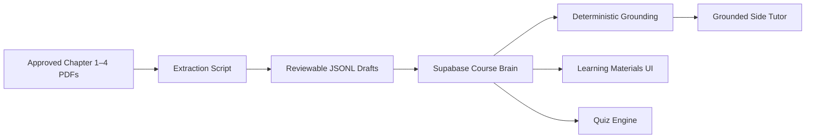

# Course Brain v1 Architecture

## System of record

Supabase/Postgres stores approved chapters, topics, content units, source references, quiz questions, and anonymous feedback. The original PDFs stay in controlled local or cloud storage and are not committed to Git by default.

## Trust boundary

The Course Brain is authoritative. A future language model is an explanation layer: it receives retrieved approved source excerpts, not permission to assert uncited course facts. Published content is blocked by a database constraint trigger if no source reference exists.

## MVP exclusions

Course Brain v1 deliberately excludes authentication, individual learner records, long-term progress, an external-web knowledge source, and automatic publication of AI-generated quizzes.
